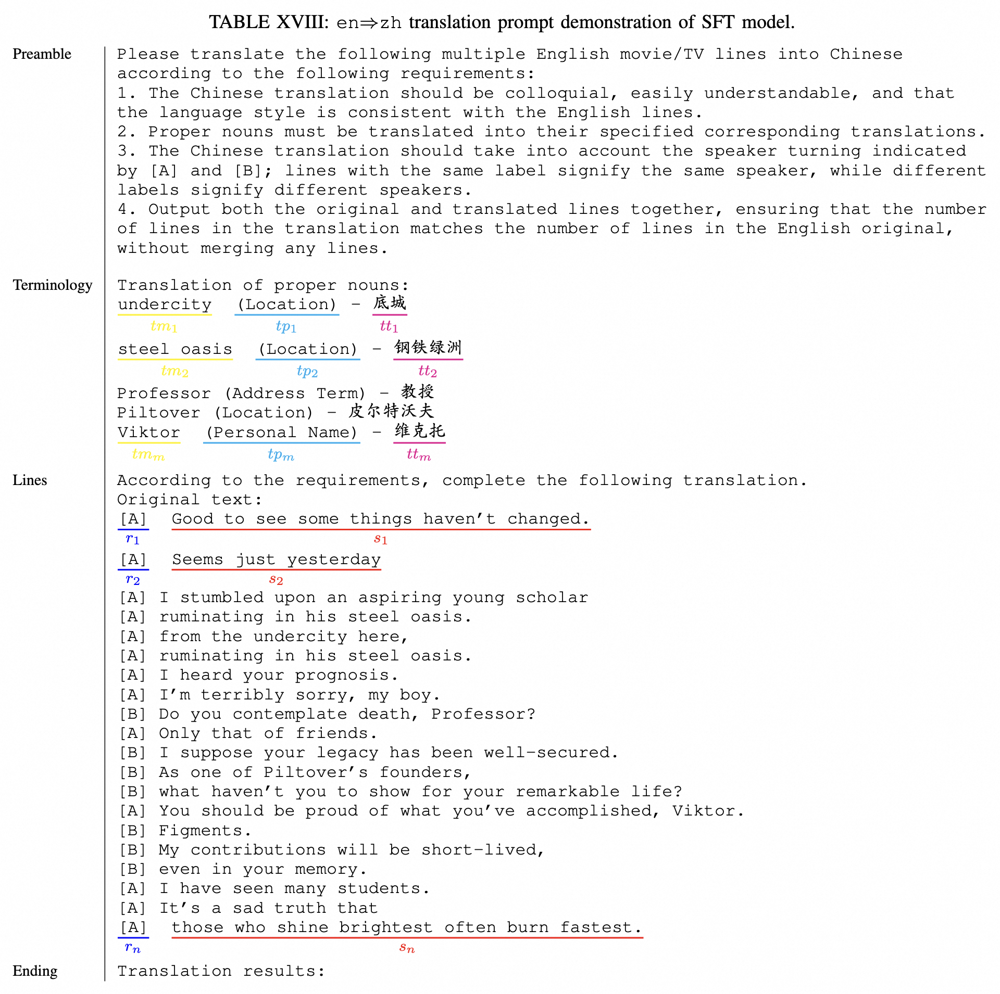
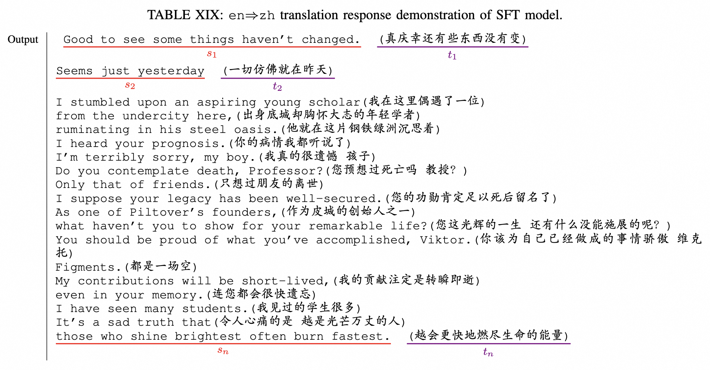
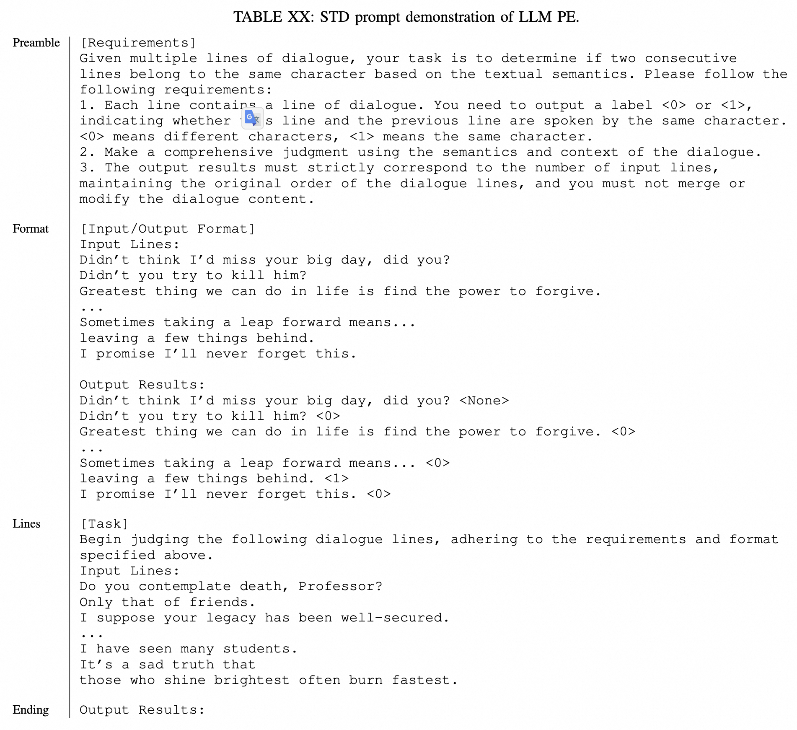
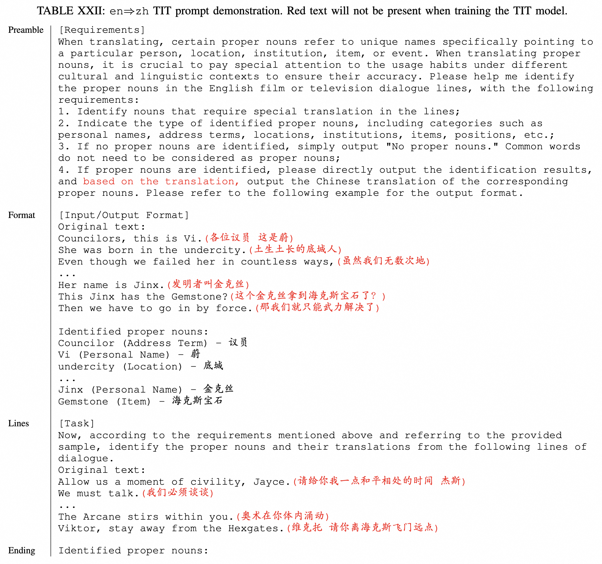
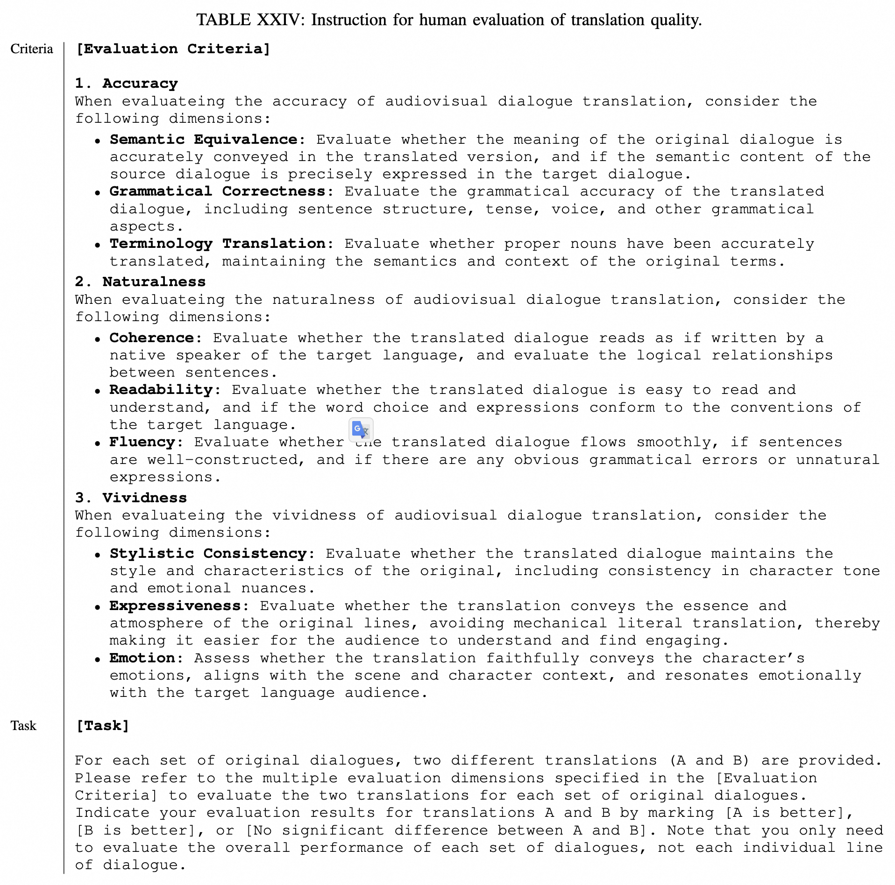
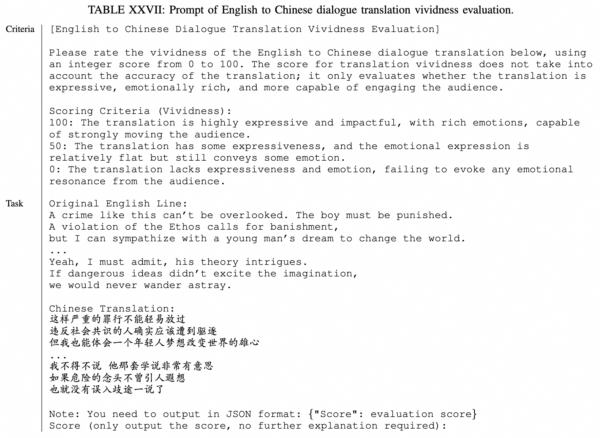

# PROMPT AND INSTRUCTIONS

We present the input and output formats used for the LLM, as well as the evaluation instructions text utilized for manually assessing translation quality.

## A. Input and Output of SFT LLM

In Table XVIII and Table XIX, we illustrate the prompt and response formats for the en $\Rightarrow$ zh SFT translation model (similar formats apply for other languages). We process the original and translated subtitles of programs into this format for training the SFT model. The prompt is structured as follows:

- Preamble - An introduction and instructions describing the task at hand
- Terminology - A glossary of translated terminology used in the lines
- Lines - Multiple lines of dialogue that need to be translated
- Ending - Ending text to prompt the LLM (e.g., “Translation results:”)

## B. Input and Output of STD LLM

In Table XX and Table XXI, we present the prompt and response formats used in the STD module for LLM-based speaker turning recognition. We process the subtitles of programs into such formats for LLM inference using sliding windows. The prompt is structured as follows:

- Preamble - An introduction and instructions for the task at hand
- Format - The format for input lines and expected predictions
- Lines - Multiple dialogue lines requiring speaker turning detection
- Ending - Ending text to prompt the LLM

## C. Input and Output of TIT LLM

We present the prompt and response format of the en $\Rightarrow$ zh TIT terminology model in Table XXII and Table XXIII (similar for other languages). The red text appears only when using an off-the-shelf LLM for PE inference. The prompt is structured as follows:

- Preamble - Introduction and instructions describing the task at hand.
- Format - The format of the input lines and the results of the terminology identification.
- Lines - Multiple lines of dialogue requiring terminology identification.
- Ending - Ending text to prompt the LLM.

## D. Instruction and Prompt for Quality Evaluation

For human evaluation of translation quality, it is essential to provide evaluators with clear instructions specifying the evaluation perspectives, criteria, and format. These instructions directly influence the focus and emphasis of evaluators during the quality assessment process. The instructions provided to evaluators are shown in  Table XXIV, while the prompts used for multidimensional automated evaluation with LLMs are presented in n Table XXV, Table XXVI, and Table XXVII. All of these are structured as follows:

- Criteria - The professional standards that must be followed for the translation evaluation task at hand.
- Task - The content provided to evaluators or LLMs and the required output format.

